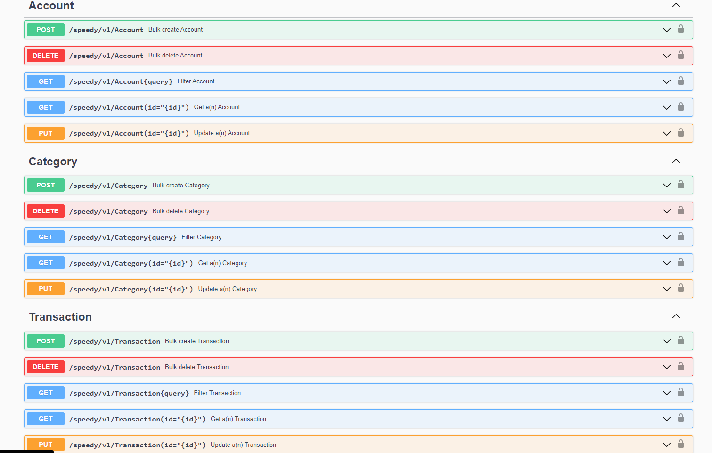
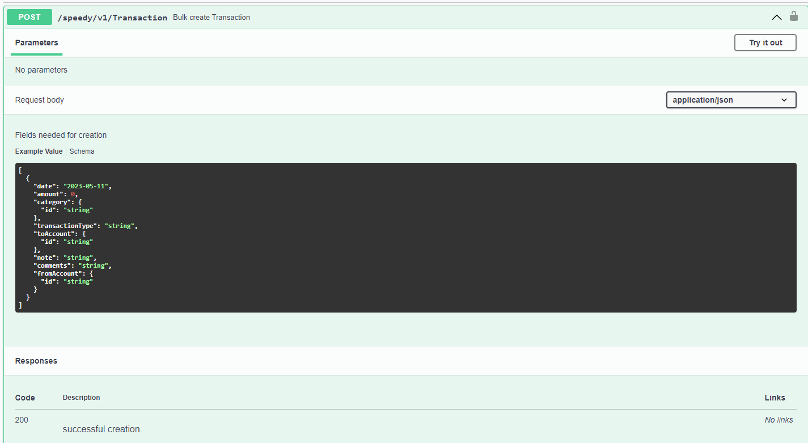
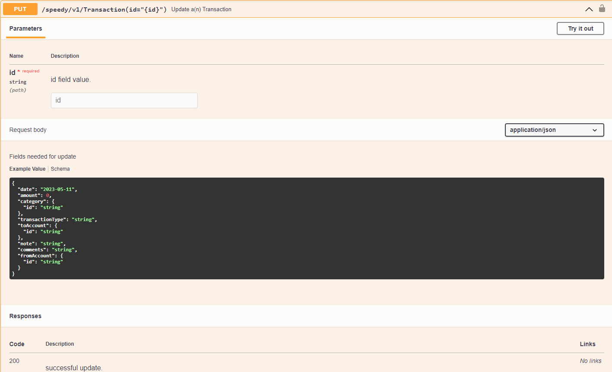
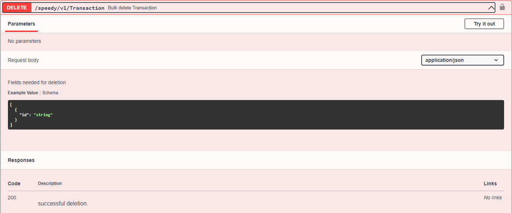
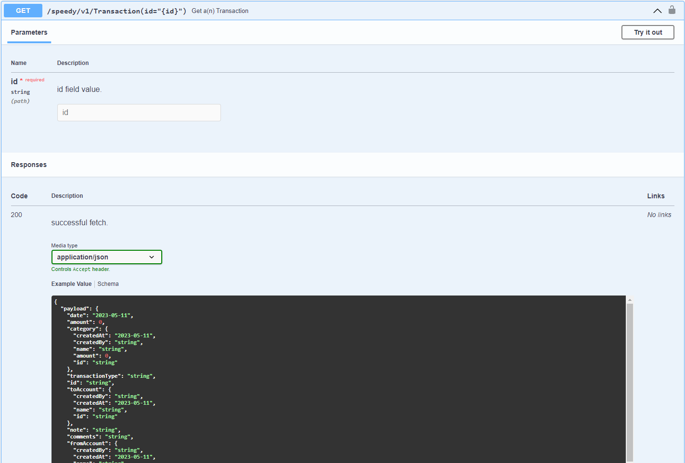
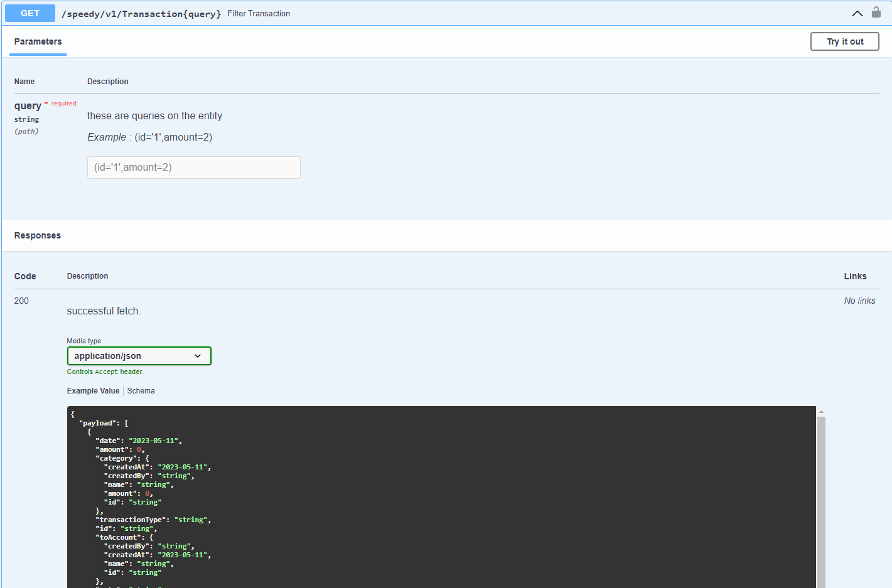

# Open Api Integration

#### Speedy Documentation

Speedy comes with api documentation included

### Maven Dependency

include speedy api documentation dependency, speedy will not override any other api documentation, just add it own api
docs

```xml
<dependency>
    <groupId>com.github.silentsamurai</groupId>
    <artifactId>spring-boot-starter-speedy-open-api</artifactId>
    <version>3.1.4</version>
</dependency>
```

also include the open api ui as well

```xml
<dependency>
    <groupId>org.springdoc</groupId>
    <artifactId>springdoc-openapi-ui</artifactId>
    <version>1.6.4</version>
</dependency>
```

create an open api customizer so that speedy can add api documentation.

```java
@Configuration
public class SpeedyConfig implements ISpeedyConfiguration {

    ...

    @Bean
    public OpenApiCustomizer customizer(SpeedyOpenApiCustomizer speedyOpenApiCustomizer) {
        return speedyOpenApiCustomizer::generate;
    }

    ...
}
```

speedy will generate the api docs of all the entity present in the spring project

apis create per entity are

- Post api to create the entity
- Put api to update the entity with primary key
- Delete api with primary key
- Get api to retrieve resource with primary key
- Get api to filter resource by different criteria, see (queries [here](get-operation.md))



#### POST Api

use this api to create a resource in the speedy system. this api takes a list of resource, so you can create more than
one resource.



#### PUT Api

use this api to update a single resource in the speedy system.



#### DELETE Api

bulk delete api to remove multiple resource.



#### GET By Id Api

use this api to get a single resource



#### GET Api

use this api to get a multiple resource and filter them via speedyQueryImpl

